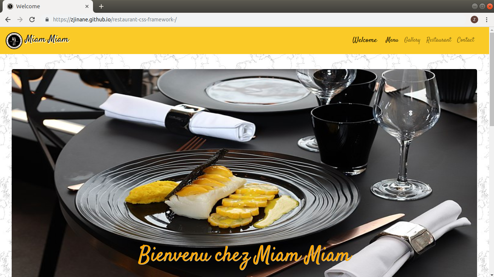
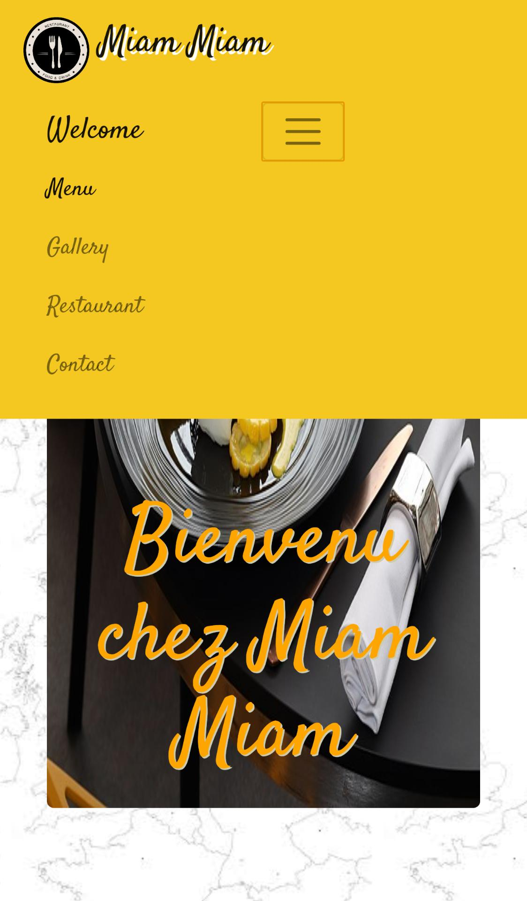
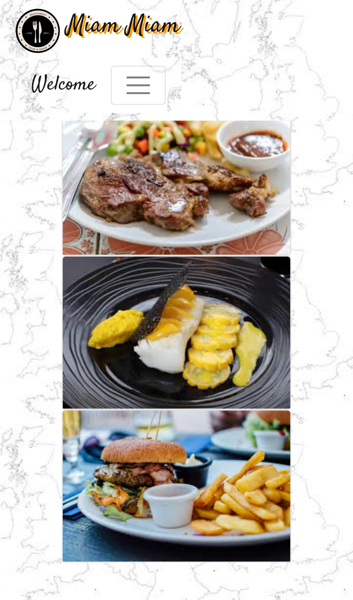
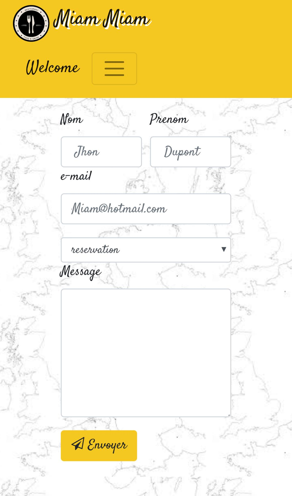

# restaurant-css-framework

## Site Web Responsive-

Le Responsive Web design est une approche de conception Web qui vise à l'élaboration de sites offrant une expérience de lecture et de navigation optimales pour l'utilisateur quelle que soit sa gamme d'appareil (téléphones mobiles, tablettes, liseuses, moniteurs d'ordinateur de bureau).

*******

------
appercu sur ordinateur

------
 appercu sur mobiles

******
# [lien du site restaurant](https://zjinane.github.io/restaurant-css-framework-/) 

******
# Langages utilisés

-HTML5,Css

-Bootstrap

